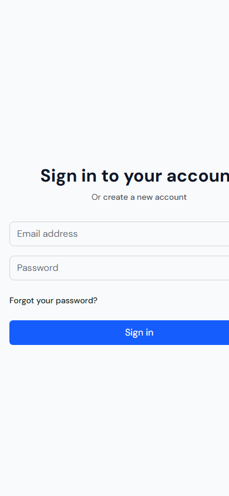
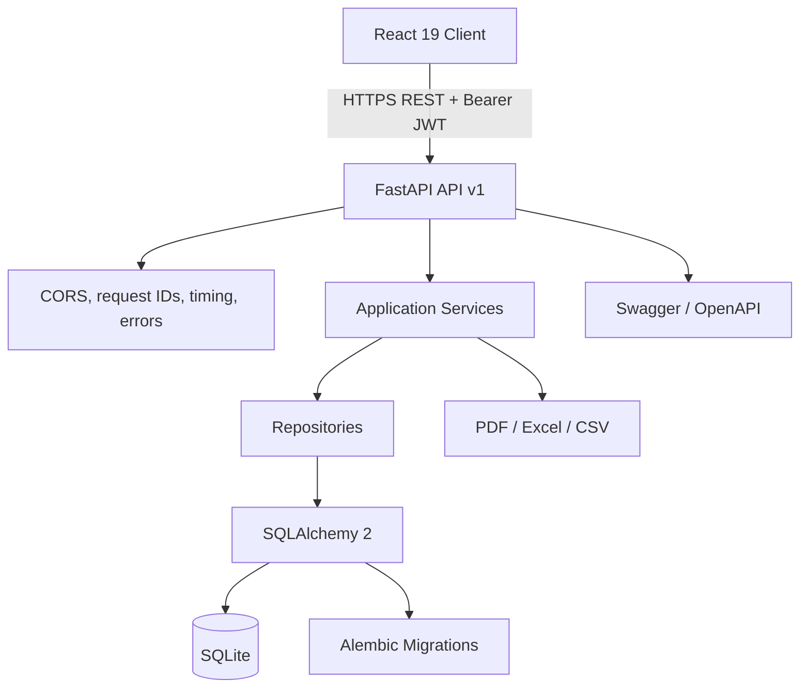
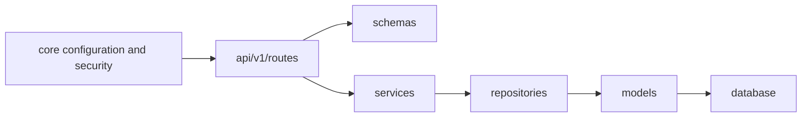

# PeopleFlow HRMS

PeopleFlow is a full-stack Human Resource Management System for authentication, employee profiles, attendance, leave, payroll, notifications, and workforce reporting.

> **Status:** Milestone 11 complete — release hardening, integration repair, performance optimization, automated testing, OpenAPI documentation, and final project documentation.

## Screenshots

| Desktop sign-in | Mobile sign-in |
| --- | --- |
|  | 

## Features

- JWT access and refresh token authentication with logout revocation
- Employee, HR, and Admin role-based access control
- Self-registration with role selection (Employee vs HR Operations)
- Required email verification flow for self-registered users
- SMTP email service integration for verification and password reset links with premium HTML templates
- Employee profiles, documents, profile photos, directory search, and pagination
- Check-in/check-out, calculated work hours, history, corrections, and reminders
- Paid, Sick, Casual, and Unpaid leave with calendar selection and HR review
- Automatic attendance synchronization when leave is approved
- Payroll generation, employee history, summary statistics, and PDF payslips
- Persistent in-app attendance, leave, and payroll notifications
- Attendance, leave, payroll, employee, and analytics reports
- CSV, Excel, and PDF report exports
- Request IDs, response timing, structured application logging, and consistent errors
- Interactive Swagger/OpenAPI documentation

## Technology stack

| Layer | Technology |
| --- | --- |
| Frontend | React 19, Vite, Tailwind CSS |
| Routing | React Router |
| Server state | TanStack React Query |
| Forms | React Hook Form |
| Charts | Recharts |
| Calendar | React Big Calendar |
| Backend | FastAPI, Pydantic |
| Persistence | SQLite, SQLAlchemy 2, Alembic |
| Authentication | JWT access/refresh tokens, bcrypt |
| Reports | ReportLab, OpenPyXL, CSV |
| Backend tests | pytest, FastAPI TestClient |
| Frontend tests | Vitest, Testing Library, jsdom |
| Quality | Ruff, ESLint, Vite production build |

## Architecture

PeopleFlow is a modular monolith with three deployment tiers and Clean Architecture boundaries.



### Backend dependency direction



- Routes own HTTP parsing, authorization dependencies, and response contracts.
- Services own workflows such as leave approval, attendance synchronization, and payroll calculation.
- Repositories own database queries and pagination.
- SQLAlchemy models define persistence; Pydantic schemas define API contracts.
- Alembic is the only supported mechanism for schema evolution.

## Repository structure

```text
.
├── backend/
│   ├── alembic/versions/        # Ordered database migrations
│   ├── app/
│   │   ├── api/v1/routes/       # Versioned REST controllers
│   │   ├── core/                # Settings, JWT dependencies, errors, logging
│   │   ├── database/            # Engine, sessions, declarative base
│   │   ├── models/              # SQLAlchemy entities
│   │   ├── repositories/        # Data access and pagination
│   │   ├── schemas/             # Pydantic request/response contracts
│   │   ├── services/            # Application and reporting workflows
│   │   ├── utils/exports/       # CSV, Excel, and PDF generators
│   │   └── main.py              # FastAPI factory and middleware
│   ├── tests/                   # API and integration tests
│   ├── uploads/                 # Runtime files; contents ignored by Git
│   ├── requirements.txt
│   └── requirements-dev.txt
├── frontend/
│   ├── src/
│   │   ├── api/                 # Axios API clients
│   │   ├── components/          # Shared and role-specific UI
│   │   ├── context/             # Authentication state
│   │   ├── pages/               # Auth, dashboard, leave, and reports
│   │   ├── routes/              # Protected routing
│   │   └── test/                # Frontend test setup
│   ├── package.json
│   ├── vite.config.js
│   └── vitest.config.js
├── docs/screenshots/
├── .gitignore
└── README.md
```

## Prerequisites

- Python 3.12+
- Node.js 20.19+ or 22.12+
- npm 10+
- Git

SQLite is embedded; no separate database server is needed.

## Default Credentials

A default system administrator account is pre-seeded in the database for local quick-start:
- **Email:** `admin@peopleflow.com`
- **Password:** `AdminPassword123!`
- **Employee ID:** `ADMIN001`

## Installation

```bash
git clone <repository-url>
cd odoo
```

### Backend

Windows PowerShell:

```powershell
cd backend
python -m venv .venv
.\.venv\Scripts\Activate.ps1
python -m pip install -r requirements-dev.txt
Copy-Item .env.example .env -ErrorAction SilentlyContinue
python -m alembic upgrade head
python -m uvicorn app.main:app --reload
```

macOS/Linux:

```bash
cd backend
python -m venv .venv
source .venv/bin/activate
python -m pip install -r requirements-dev.txt
cp .env.example .env
python -m alembic upgrade head
python -m uvicorn app.main:app --reload
```

The API runs on `http://localhost:8000`.

### Frontend

```bash
cd frontend
npm install
cp .env.example .env        # PowerShell: Copy-Item .env.example .env
npm run dev
```

The client runs on `http://localhost:5173`.

## Environment variables

Backend configuration uses the `HRMS_` prefix to prevent collisions with host variables.

| Variable | Default purpose |
| --- | --- |
| `HRMS_APP_NAME` | API display name |
| `HRMS_APP_VERSION` | API release version |
| `HRMS_ENVIRONMENT` | `development`, `test`, `staging`, or `production` |
| `HRMS_DEBUG` | FastAPI debug behavior |
| `HRMS_API_V1_PREFIX` | Versioned API prefix, normally `/api/v1` |
| `HRMS_DATABASE_URL` | SQLAlchemy URL, normally `sqlite:///./hrms.db` |
| `HRMS_BACKEND_CORS_ORIGINS` | JSON array of trusted browser origins |
| `HRMS_LOG_LEVEL` | Python logging level |
| `HRMS_SECRET_KEY` | JWT signing secret; replace outside local development |
| `HRMS_ACCESS_TOKEN_EXPIRE_MINUTES` | Access token lifetime |
| `HRMS_REFRESH_TOKEN_EXPIRE_DAYS` | Refresh token lifetime |
| `HRMS_SMTP_HOST` | SMTP server host (e.g. `smtp.gmail.com`) |
| `HRMS_SMTP_PORT` | SMTP port, defaults to `587` |
| `HRMS_SMTP_USER` | SMTP username |
| `HRMS_SMTP_PASSWORD` | SMTP password / app password |
| `HRMS_SMTP_FROM_EMAIL` | Sender address, defaults to `noreply@hrms.local` |
| `HRMS_FRONTEND_URL` | Base URL of frontend application, defaults to `http://localhost:5173` |

The frontend uses `VITE_API_URL`, defaulting to `http://localhost:8000/api/v1`.

Never commit real `.env` files, signing secrets, SQLite databases, or uploaded documents.

## API documentation

With the backend running:

- Swagger UI: `http://localhost:8000/api/v1/docs`
- OpenAPI JSON: `http://localhost:8000/api/v1/openapi.json`
- Health check: `GET http://localhost:8000/api/v1/health`

Protected operations use `Authorization: Bearer <access-token>`. Swagger’s **Authorize** button accepts the token.

### Endpoint summary

| Module | Method and path | Access |
| --- | --- | --- |
| Health | `GET /api/v1/health` | Public |
| Auth | `POST /auth/register`, `/login`, `/logout`, `/refresh` | Mixed |
| Auth | `POST /auth/forgot-password`, `/reset-password`, `/verify-email` | Public |
| Auth | `GET /auth/me` | Authenticated |
| Employees | `GET/POST /employees` | HR/Admin |
| Employees | `GET/PUT /employees/{id}` | Self or HR/Admin |
| Employees | `DELETE /employees/{id}` | HR/Admin |
| Employee files | `POST /employees/{id}/upload-avatar` | Self or HR/Admin |
| Employee files | `POST /employees/{id}/upload-document` | Self or HR/Admin |
| Attendance | `POST /attendance/check-in`, `/check-out` | Authenticated |
| Attendance | `GET /attendance/me/today`, `/week`, `/month`, `/history` | Authenticated |
| Attendance | `GET/PUT /attendance` resources and corrections | HR/Admin where applicable |
| Leave | `POST /leaves/apply`, `GET /leaves/me` | Authenticated |
| Leave | `GET /leaves`, `PUT /leaves/{id}/approve` or `/reject` | HR/Admin |
| Notifications | `GET /notifications`, `PUT /notifications/{id}/read`, `/read-all` | Authenticated |
| Payroll | `POST /payroll/generate`, `GET /payroll/history`, `/stats` | HR/Admin |
| Payroll | `GET /payroll/me`, `GET /payroll/{id}/pdf` | Authenticated/owner |
| Reports | `GET /reports/dashboard`, `/attendance`, `/leave`, `/payroll` | Role-filtered |
| Reports | `GET /reports/employees`, `/analytics/*`, `/export/*/{format}` | HR/Admin |
| AI Assistant | `POST /ai/chat` | Authenticated |

The OpenAPI document is authoritative for query parameters, request bodies, enums, and response schemas.

## Database migrations

```bash
cd backend
python -m alembic upgrade head
```

After changing a SQLAlchemy model:

```bash
python -m alembic revision --autogenerate -m "describe the schema change"
python -m alembic check
python -m alembic upgrade head
```

Review generated migrations before applying them.

## Testing and quality gates

Backend:

```bash
cd backend
python -m ruff check .
python -m pytest -q
python -m alembic check
```

Backend coverage includes health, authentication and token revocation, employee authorization and CRUD, file operations, leave approval, attendance synchronization, notifications, payroll, reports, validation errors, observability headers, and OpenAPI generation.

Frontend:

```bash
cd frontend
npm run lint
npm test
npm run build
```

Frontend tests cover reusable status rendering and protected-route behavior for anonymous, allowed, and denied users.

## Performance and reliability

- Page and role-dashboard modules are lazy-loaded to reduce the initial JavaScript payload.
- React Query owns server cache invalidation for leave, attendance, and notification changes.
- Report list endpoints are paginated and aggregate queries execute in the database.
- SQLAlchemy relationships are eagerly loaded where response mapping would otherwise cause N+1 queries.
- API responses include `X-Request-ID` and `X-Response-Time-Ms` headers.
- Validation failures and unhandled exceptions are logged with request context.
- Leave approval, attendance mutation, and notification creation are committed as one workflow.

SQLite is suitable for local development and hackathon deployment. For concurrent production workloads, migrate `HRMS_DATABASE_URL` to PostgreSQL and review connection-pool settings.

## Development workflow

1. Branch from `main` using `feature/...`, `fix/...`, or `chore/...`.
2. Keep HTTP concerns in routes, workflows in services, and queries in repositories.
3. Add an Alembic revision for every schema change.
4. Add backend and/or frontend tests with behavior changes.
5. Run lint, tests, migration drift checks, and the production build.
6. Keep secrets and runtime data out of Git.
7. Open a focused pull request with verification evidence.

## Milestone 11 completion

- Repaired the Reports module import failure and invalid model-field queries.
- Replaced report placeholders with real attendance, leave, payroll, employee, and analytics data.
- Completed leave and payroll report export routes.
- Added request tracing, timing, validation logging, and safer unexpected-error responses.
- Fixed token revocation so logout and refresh-token replay are enforced across requests.
- Removed sensitive token values from application logs.
- Fixed frontend runtime defects and API-client import/parameter errors.
- Added route and role-dashboard code splitting.
- Added backend release workflow tests and frontend component tests.
- Verified OpenAPI generation, migration consistency, lint, tests, and production build.
- Added real desktop/mobile screenshots and architecture diagrams.

### Settings & Policies API

| Method | Endpoint | Access | Purpose |
| --- | --- | --- | --- |
| GET | `/api/v1/settings/company` | Authenticated | Fetch company profile information |
| PUT | `/api/v1/settings/company` | Admin | Update company profile details |
| GET | `/api/v1/settings/leave-policy` | Authenticated | Fetch leave policy settings |
| PUT | `/api/v1/settings/leave-policy` | Admin | Update leave policy settings |
| GET | `/api/v1/settings/working-hours` | Authenticated | Fetch shift hours & work days |
| PUT | `/api/v1/settings/working-hours` | Admin | Update shift hours & work days |
| GET | `/api/v1/settings/holidays` | Authenticated | List all company holidays |
| POST | `/api/v1/settings/holidays` | Admin | Add a new holiday |
| DELETE | `/api/v1/settings/holidays/{holiday_id}` | Admin | Remove a scheduled holiday |
| GET | `/api/v1/settings/role-permissions` | Admin | Fetch role permissions matrix |
| PUT | `/api/v1/settings/role-permissions/{role}` | Admin | Toggle permissions for a role |
| POST | `/api/v1/auth/change-password` | Authenticated | Change password for logged-in user |

## Milestone 10 scope

Implemented:

Backend:
- Created new `CompanySettings`, `LeavePolicySettings`, `WorkingHoursSettings`, `Holiday`, and `RolePermission` models.
- Set up database migrations and initial seed values for policies, working hours, and roles.
- Created `SettingsRepository` and `SettingsService` layers.
- Added `/settings/*` and `/auth/change-password` routes.
- Implemented `PermissionChecker` for dynamic, database-driven role permission verification instead of static role checks.

Frontend:
- Built the `SettingsPage.jsx` panel with tabs for My Profile, Change Password, Company Info, Leave Policy, Holidays, and Role Permissions.
- Added Settings link to desktop and mobile menus.
- Integrated optional **Dark Mode** toggle in the main nav header and Settings page, utilizing local storage persistence and glassmorphism styling overrides in `index.css`.

## License

No license has been selected. Add one before public distribution.
