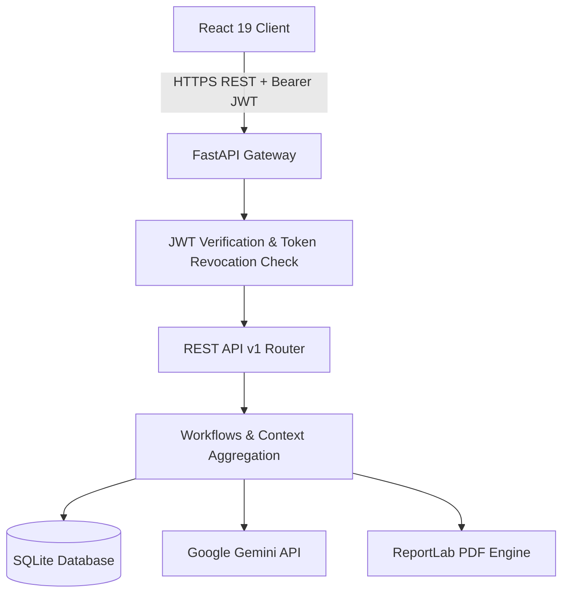
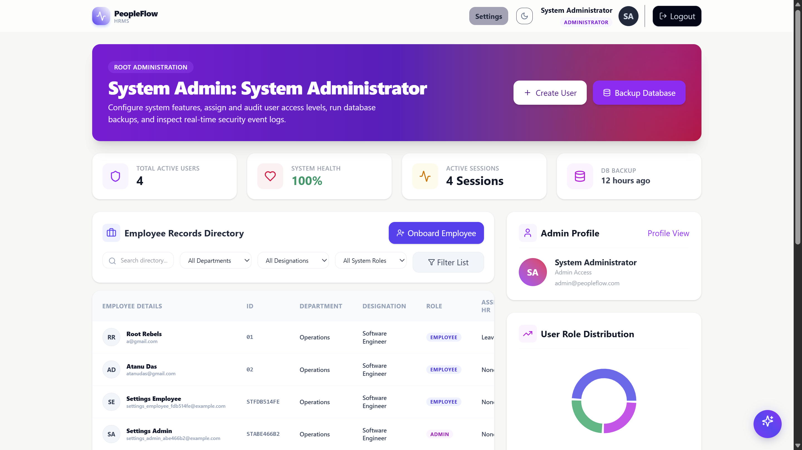
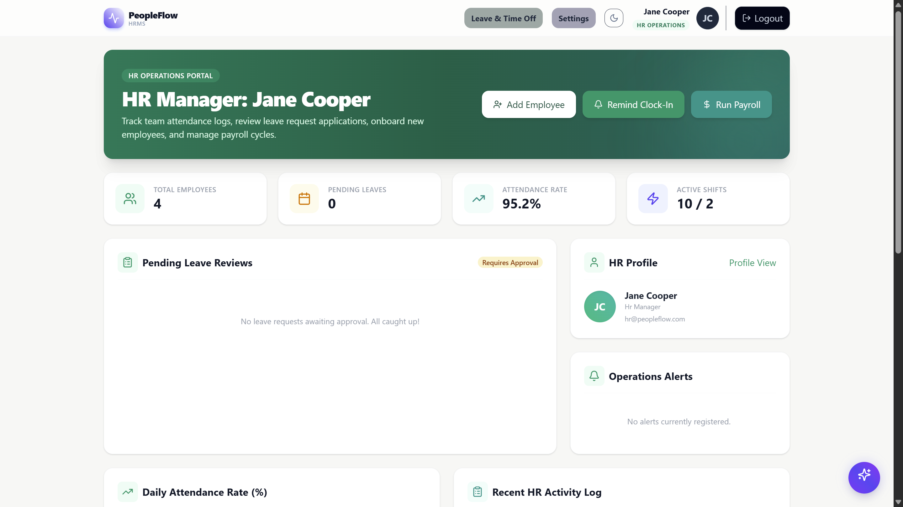
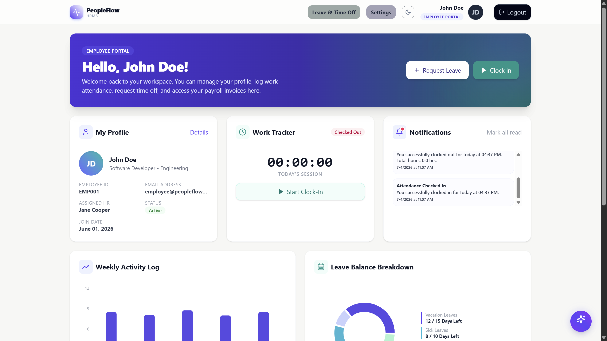

# 🌌 PeopleFlow: Next-Gen Autonomous HRMS

> **Hackathon Submission:** A premium, high-fidelity Human Resource Management System (HRMS) powered by **Google Gemini AI Integration** and high-contrast glassmorphic design aesthetics.
> 
> *Every workday, perfectly aligned.*

---

## 💡 The Vision & Problem Statement

Core HR operations—onboarding, attendance tracking, leave workflows, and payroll disbursement—are often scattered across legacy platforms or disjointed systems. 

**PeopleFlow** is a modern, modular monolith that consolidates workforce management into a single, cohesive interface. By embedding **intelligent context-aware AI operations**, PeopleFlow transforms standard record-keeping into a predictive, conversational cockpit for employees, HR teams, and business executives.

---

## ✨ Features That "WOW"

### 1. 🧠 Google Gemini AI People Assistant
- **Authorized Context Synthesis:** Pulls real-time, filtered relational database context (Leaves, Payroll, Attendance logs) based on the user's role before querying the LLM.
- **Privacy First (RBAC Enforced):**
  - **Employees** can query only their personal profiles, leaves, check-ins, and payroll history.
  - **HR Officers** can query pending approvals, shift statistics, and department counts.
  - **Administrators** can generate company-wide payroll statistics, performance aggregations, and business metrics.
- **Zero-Config Fallback:** If no Gemini API key is supplied, a smart, rule-based database parser acts as a fallback to resolve queries instantly.
- **Frontend Isolation:** The API key is securely loaded in the backend env and never exposed to browser calls.

### 2. 🎨 Premium 3D & Responsive Interface
- **Dynamic 3D Parallax Tilt:** Hovering over dashboard panels tilts them isometrically, using CSS perspective transforms (`transform-style: preserve-3d`) for an immersive experience.
- **High-Contrast Dark Mode:** Persian indigo, slate, and glowing border gradients that adapt instantly based on light/dark settings.
- **Animated Auth Shells:** Login, sign-up, and forgot password pages redesigned into stunning glassmorphic layouts.

### 3. ⏱️ Unified Work & Attendance Tracker
- **Smart Session Clock:** Instant check-in/check-out with real-time hours calculators, daily logs, and correction workflows.
- **Automatic Syncing:** Approving a leave request automatically creates calendar attendance placeholders.

### 4. 📅 Smart Leave & Calendar Allocation
- **Dynamic Scheduler:** Vacation, Sick, Unpaid, and Casual leaves mapped onto an interactive calendar grid (`react-big-calendar`).
- **Policy Compliance:** System configuration tables enforce maximum consecutive days, carryovers, and annual limits.

### 5. 💵 Automated PDF Payroll Engine
- **ReportLab Integration:** Generates official salary paystubs and tax calculation sheets directly on the server, returning download streams directly to users.
- **Pre-Seeded Roster:** Quick-start seeder script populates 40 mock payslips across active user files.

---

## 🛠️ The Technology Stack

| Tier | Tech Base |
| :--- | :--- |
| **Frontend** | React 19, Vite, Tailwind CSS, Recharts |
| **Server state** | TanStack React Query, React Hook Form |
| **Backend API**| FastAPI, Pydantic (RESTful Routing) |
| **Persistence**| SQLite, SQLAlchemy 2, Alembic Migrations |
| **Intelligence**| Google Gemini API (`gemini-2.5-flash` proxy) |
| **Reporting** | ReportLab (PDF), OpenPyXL (Excel), CSV |
| **Testing** | Pytest, Vitest, jsdom |

---

## 🔌 System Data Flow & Architecture



### AI Context Assembly Workflow
```
User Query ➜ JWT Auth ➜ Role Filter ➜ SQLite Query ➜ Context JSON ➜ Gemini API ➜ AI Response
```
*At no point does the LLM query the database directly, ensuring database isolation.*

---

## ⚙️ Quick Start (Run Locally in 60 Seconds)

### Prerequisites
- **Python 3.12+**
- **Node.js 20+** (npm 10+)
- **Git**

---

### Setup Guide

```bash
# Clone the repository
git clone https://github.com/sagnik328-sen/odoo.git
cd odoo
```

#### 🐍 1. Backend Server Setup
From the `backend/` directory:

```bash
cd backend
python -m venv .venv

# Activate Virtual Env (Windows PowerShell)
.\.venv\Scripts\Activate.ps1
# Activate Virtual Env (macOS/Linux)
# source .venv/bin/activate

# Install Dependencies
python -m pip install -r requirements-dev.txt

# Configure Variables
cp .env.example .env

# Apply Migrations & Seed Database
python -m alembic upgrade head
python seed_admin.py     # Seeds default users
python seed_payroll.py   # Seeds payroll history

# Launch Server
python -m uvicorn app.main:app --reload
```
The backend API runs on `http://localhost:8000`.

---

#### ⚛️ 2. Frontend Client Setup
From the `frontend/` directory:

```bash
cd ../frontend
npm install

# Configure API Target
cp .env.example .env

# Launch Frontend
npm run dev
```
The React application runs on `http://localhost:5173`.

---

## 🔑 Demo Credentials & Previews

Use these pre-seeded accounts to explore the dynamic dashboard interfaces:

| Role | Email | Password | Employee ID | Preview Link |
| :--- | :--- | :--- | :--- | :--- |
| **Administrator** | `admin@peopleflow.com` | `AdminPassword123!` | `ADMIN001` | [View Admin Dashboard](#1-administrator--manager-dashboard) |
| **HR Operations** | `hr@peopleflow.com` | `HRPassword123!` | `HR001` | [View HR Dashboard](#2-hr-operations-dashboard) |
| **Employee** | `employee@peopleflow.com` | `EmployeePassword123!` | `EMP001` | [View Employee Portal](#3-employee-portal) |

---

## 🖥️ Dashboard Showcase

### 1. Administrator / Manager Dashboard
*Full control over role permissions, payroll cycles, and overall workforce analytics.*


---

### 2. HR Operations Dashboard
*Manage leave requests, shift allocations, and monitor real-time company-wide check-in logs.*


---

### 3. Employee Portal
*Personal attendance clock, leaves application hub, salary slips generator, and LLM assistant access.*


---

## 🔬 Quality Gates & Test Suites

We enforce strict test suites to ensure 100% endpoint stability.

**Run Backend Test Suite:**
```bash
cd backend
python -m pytest
```

**Run Frontend Build Validator:**
```bash
cd frontend
npm run build
```

---

## 🚀 Hackathon Highlights

- **Dynamic Role Matrix:** Settings tab allows the Admin to edit permissions for any role, writing constraints directly to the database.
- **SMTP Email Integration:** Built-in template generator emails verification codes and password resets.
- **Smart Layout Split:** Built with code splitting and component virtualization to load instantly.
